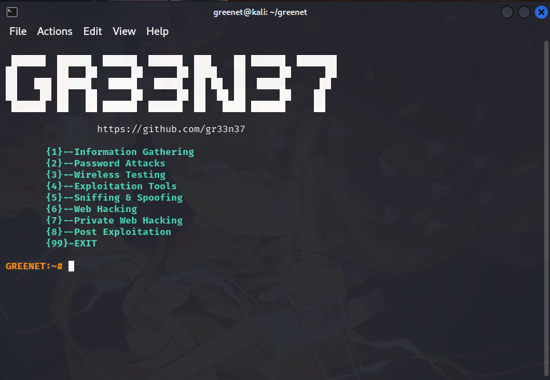

# Introduction

Am a self taught Linux admin user and a peneration tester, Possessing some skills in both Defense and offensive penetration testing. I have a dream to help others also perfect in the same game this is why i created this , i wish it can also help you along the way.

Well in this book, i will be documenting my journey in penetration testing, i will be putting out writ-ups of machines that i happen to get my hands on, i will also document all new skills i happen to learn throughout the process.

I believe their is **nothing hard is life if you are committed to it**, waking up with a aim of creating or learning something new is the fire that keeps every IT enthusiast. In the world filled with knowledge i try my best to understand what comes my way where sometimes i might feel like a fraud of not knowing everything. **Life is like a book having many pages,  if one ends you open another one.** \
**Lets do something today our future selves will be proud off.**&#x20;

I will try and keep this as accurate as possible, with some examples of how the technique works. Nothing advanced this is just the basics and hopefully, well in the future it will help some to understand what "Key Words" or areas to search for when trying to find more sophisticated articles.

<pre class="language-markdown"><code class="lang-markdown"><strong>Social media handles
</strong><strong>1. twitter : @gr33n37
</strong><strong>2. github  : gr33n37
</strong><strong>3. Youtube : @gr33n37
</strong><strong>4. Blog    : https://gr33n37.blogspot.com
</strong></code></pre>

<figure><figcaption></figcaption></figure>
