# vegeta1

### Port Scanning

```shell
nmap -sV -sC -T4 -p- -oN vegeta1 192.168.188.73
```

```
# Nmap 7.94SVN scan initiated Mon Apr 15 00:15:34 2024 as: nmap -sV -sC -T4 -p- -oN vegeta1 192.168.188.73
Warning: 192.168.188.73 giving up on port because retransmission cap hit (6).
Nmap scan report for 192.168.188.73
Host is up (0.20s latency).
Not shown: 65298 closed tcp ports (conn-refused), 235 filtered tcp ports (no-response)
PORT   STATE SERVICE VERSION
22/tcp open  ssh     OpenSSH 7.9p1 Debian 10+deb10u2 (protocol 2.0)
| ssh-hostkey: 
|   2048 1f:31:30:67:3f:08:30:2e:6d:ae:e3:20:9e:bd:6b:ba (RSA)
|   256 7d:88:55:a8:6f:56:c8:05:a4:73:82:dc:d8:db:47:59 (ECDSA)
|_  256 cc:de:de:4e:84:a8:91:f5:1a:d6:d2:a6:2e:9e:1c:e0 (ED25519)
80/tcp open  http    Apache httpd 2.4.38 ((Debian))
|_http-title: Site doesn't have a title (text/html).
|_http-server-header: Apache/2.4.38 (Debian)
Service Info: OS: Linux; CPE: cpe:/o:linux:linux_kernel

Service detection performed. Please report any incorrect results at https://nmap.org/submit/ .
# Nmap done at Mon Apr 15 00:41:29 2024 -- 1 IP address (1 host up) scanned in 1555.54 seconds

```

### port 80 enumeration

<figure>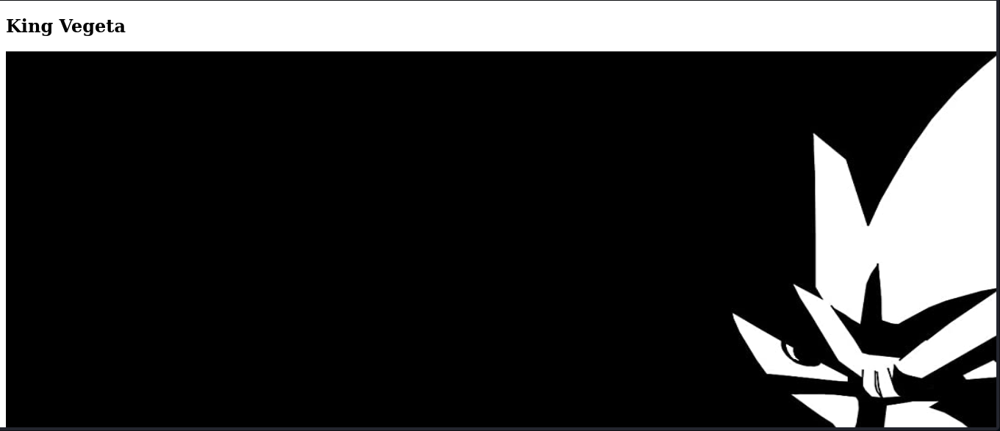<figcaption></figcaption></figure>

On using <mark style="color:yellow;">**dirsearch**</mark> we find the following folder present

```shell
dirsearch -u http://192.168.188.73
```

```
http://192.168.188.73/admin    -> REDIRECTS TO: http://192.168.188.73/admin/
http://192.168.188.73/admin/
http://192.168.188.73/admin/admin.php
http://192.168.188.73/image    -> REDIRECTS TO: http://192.168.188.73/image/
http://192.168.188.73/img    -> REDIRECTS TO: http://192.168.188.73/img/
http://192.168.188.73/login.php
http://192.168.188.73/manual    -> REDIRECTS TO: http://192.168.188.73/manual/
http://192.168.188.73/manual/index.html
http://192.168.188.73/robots.txt
http://192.168.188.73/server-status/
http://192.168.188.73/server-status

```

When we check the the <mark style="color:yellow;">robots.txt</mark> we see the content below

<figure>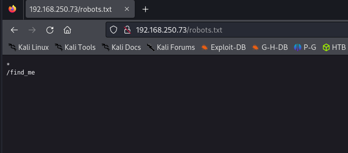<figcaption></figcaption></figure>

When you open the <mark style="color:yellow;">find\_me.html</mark> file it takes us to the site.

<figure>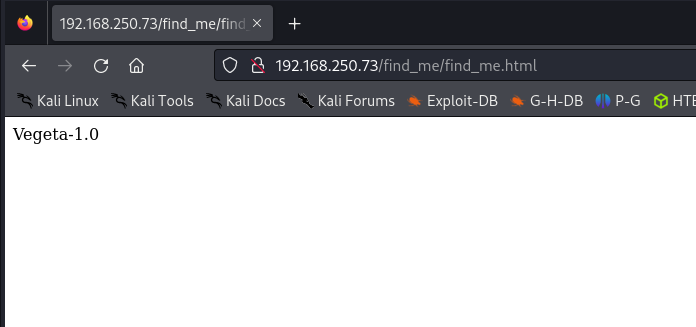<figcaption></figcaption></figure>

i decided to check it source code, where at the bottom i saw a <mark style="color:yellow;">base64</mark> hashed value and decided to decode it.

```shell
echo "hashed-value" | base4 -d
```

<figure>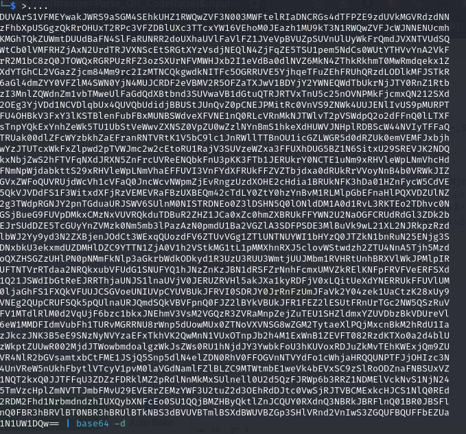<figcaption></figcaption></figure>

On decoding we get a second hash which is i thought what if i also decode it again

<figure>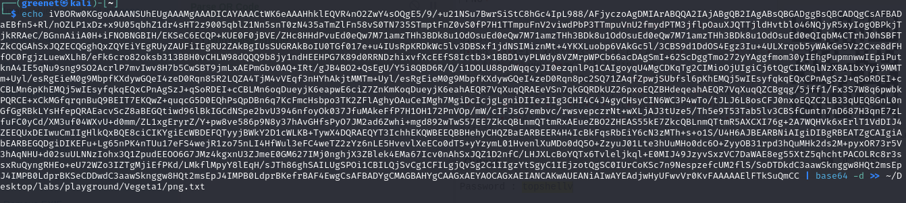<figcaption></figcaption></figure>

Decoding the second hash gives has a binary which start with <mark style="color:yellow;">PNG</mark> assuming this could be a png file. i saved this hash in a png.txt file and went to [convert.io](https://convertio.co) and uploaded the png.txt and it returned a QR code.

<figure><figcaption></figcaption></figure>

using <mark style="color:yellow;">cyberchef</mark> to see what data is inside the QRcode we see that it has a password <mark style="color:yellow;">topshellv</mark> .

<figure>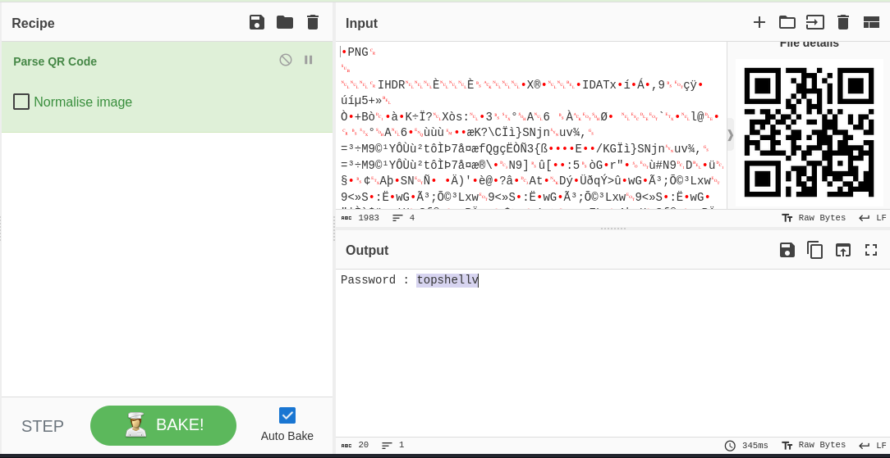<figcaption></figcaption></figure>

After all the information gathered i was just in the rabbit hole so i decided to do the post 80 enumeration again with other tools.

_Nkito_&#x20;

With nikto i received the same files us before

<figure>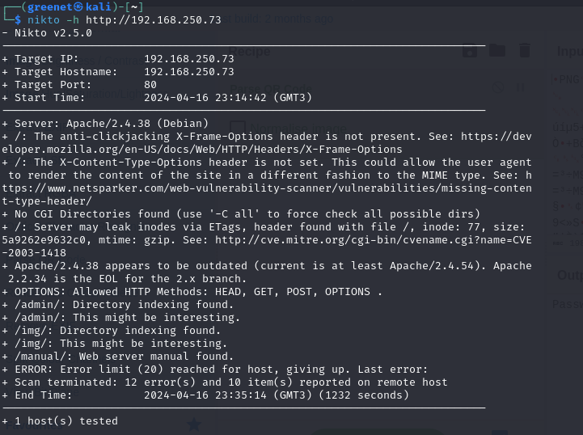<figcaption></figcaption></figure>

I decided to use gobuster with a common wordlist, and this is where i used chatGPT to generate it for me.

<figure>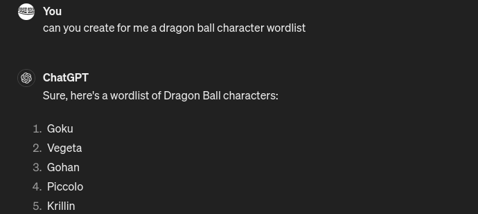<figcaption></figcaption></figure>

Gobuster

```shell
gobuster dir -u http://192.168.250.73 -w wordlist.txt -x .html,.txt,.php,.sh,.asp
```

we found another path <mark style="color:yellow;">/bulma</mark> which we didn't see before,&#x20;

<figure>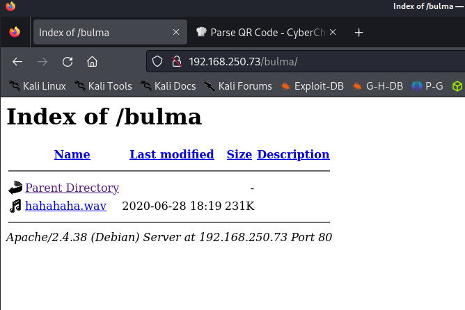<figcaption></figcaption></figure>

We see that in this path we have a audio file <mark style="color:yellow;">hahahaha.wav</mark> and on downloading and playing it sounds to be like a <mark style="color:yellow;">Morse code</mark> . checking online i came across this [site](https://morsecode.world/international/decoder/audio-decoder-adaptive.html) which can decode the message for me and we see that we found a user and password.

<figure>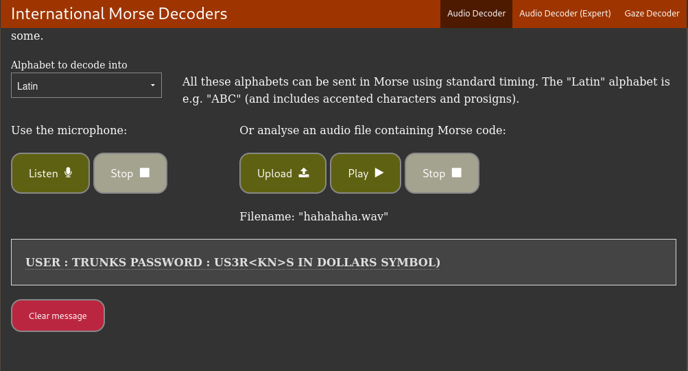<figcaption></figcaption></figure>

```
USER : TRUNKS PASSWORD : U$3R
```

### Gaining access to the server

```shell
ssh trunk@192.168.250.73
```

<figure>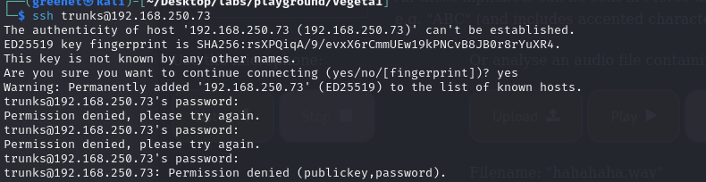<figcaption></figcaption></figure>

Typing in our password <mark style="color:yellow;">U$3R</mark> it fails to login so i decided to try typing it in lowercase and see if it will work and it was successful.

<figure>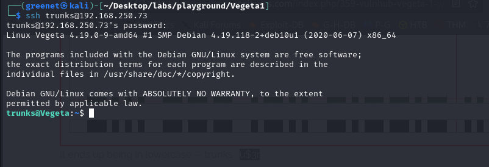<figcaption></figcaption></figure>

Listing all the directory contents(ls -al) we get our first flag in local.txt

```
cat local.txt
7bd0a8cf12c184c604506daa0f1889d6
```

### Privilege Escalation

This user contains the .bash\_history file present and on checking it, it contain useful data

### References

[https://convertio.co ](https://convertio.co)

[https://www.base64decode.org/](https://www.base64decode.org/)&#x20;

[cyberchef ](https://cyberchef.io/)

[https://morsecode.world/international/decoder/audio-decoder-adaptive.html](https://morsecode.world/international/decoder/audio-decoder-adaptive.html)
